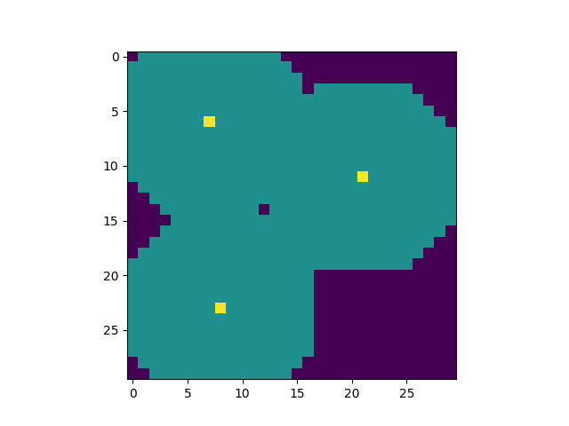
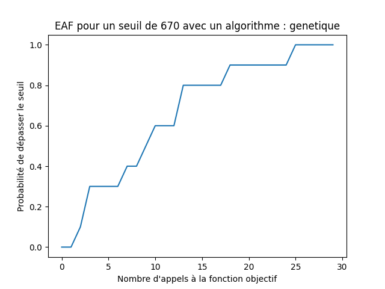
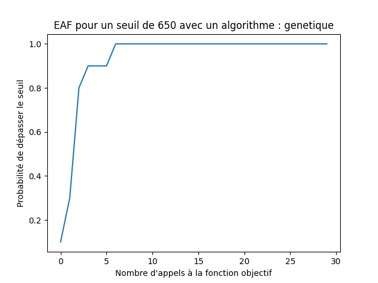

# Optimisation algorithms

Here we try to optimize the placement of sensors in order to maximize the coverage of the sensors on a map.

In order to find the coordinates of the sensors, we implement several optimisation algorithms such as simulated annealing, genetics algorithm or Distribution Estimation.

## Example of a solution

 

In yellow there are the sensors and in teal this is the area under the coverage of the sensors.

## To launch the solver

python snp.py --solver='genetique' --target=690 --iters=50 --steady-delta=50

## To launch the graph eaf

python eaf.py --solver='genetique' --target=690 --iters=30 --steady-delta=100

The Empirical Attainment Function graph shows how well an algorithm is performing at a given time.

 

## Explanation 

The snp file allows to launch the different solvers.
The algorithms of the solvers are coded in sho/algo.py.
2 more algorithms have been added : 

* annealing_simulation  
  
This function reproduces the code of an annealing_simulation in bit.
For this, we define a temperature. We choose here T = 1.2 empirically. (Intensification is preferred).

At the end of the iteration, we decrease the temperature via the formula T = 0.99 T.

* genetics

This function defines an evolutionary algorithm of type genetic algorithm in bit.
First, we initialize a population of size 100. This choice results from a compromise between the speed of execution of the code and the quality of the result.

Then, we choose that our new population will be populated at 80% by a crossover of our 20% best individuals of the previous population.

The 20% will then be chosen following a crossover of the remaining 80%.

For the crossover function, we have implemented 2 different functions.
The first one is simply to choose randomly one of the 2 parent populations.

The second one tries to simulate a real "population shuffle".
Indeed, the output population results from a linear combination of the 2 input populations. The coefficients associated with these linear combinations are chosen randomly.
Note that in the 2 crossover functions, mutations are performed via the neighb function.

## EAF

Please find the graphs of different EAF in the img folder.

We have represented the EAF for different thresholds (from 500 to 675).
For this, we perform 10 runs of 30 iterations each. We retrieve the history of each run and then display the EAF. 
For more precision, it would be appropriate to increase the number of runs, but this increases the execution time.

## Objective function

The objective function has not been changed. It is the bit.cover_sum function.

